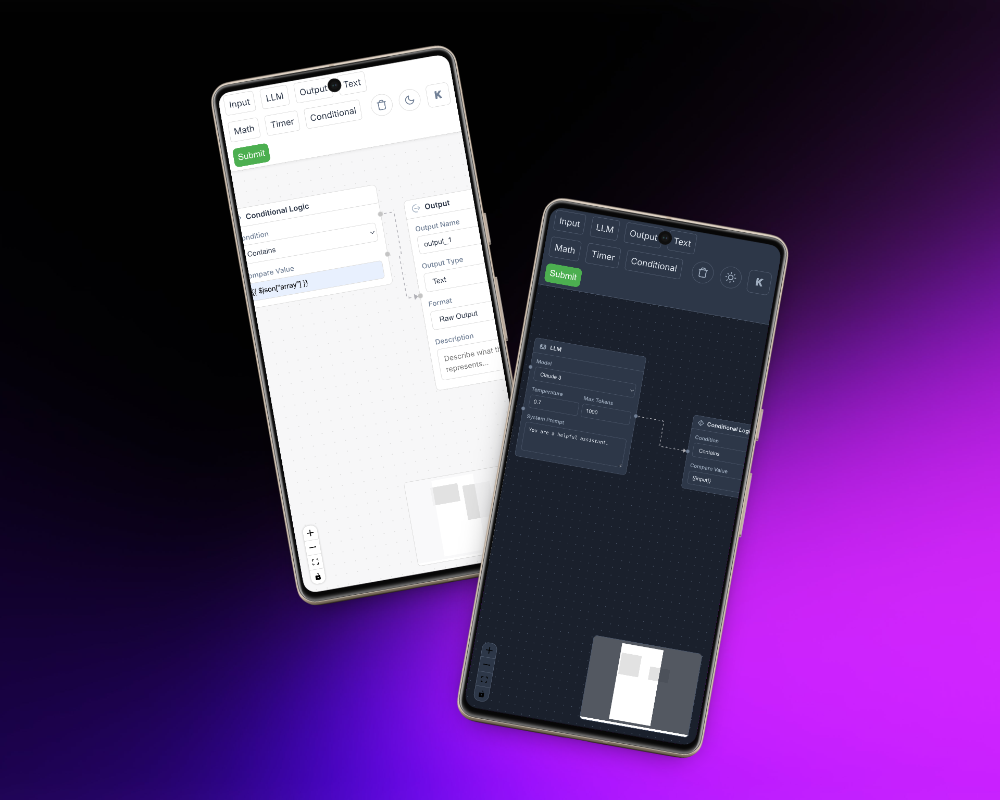

# VectorShift Frontend Technical Assessment

<div align="center">
  
  
  <p>
    <em>Modern UI with theme toggle, enhanced node abstraction, and backend integration</em>
  </p>
</div>

---

## Features Implemented

### Core Requirements

- **Node Abstraction** – Reusable `BaseNode` component with multiple custom node types.
- **Styling Overhaul** – Consistent design system with CSS Modules.
- **Text Node Logic** – Dynamic resizing, variable detection (`{{variable}}`), and dynamic handles.
- **Backend Integration** – FastAPI `/pipelines/parse` endpoint for DAG analysis with toast-based results.

### Bonus Features

- **Theme System** – Dark / Light / System theme with `localStorage` persistence.
- **Enhanced UI Components** – Modular `FormField`, `SubmitButton`, and `NodeWrapper`.
- **Project Structure Optimization** – Component-based architecture for scalability.
- **Deployment Ready** – Vercel for frontend, Render for Dockerized backend.
- **Clear Pipeline Button** – Quickly reset the workspace.
- **Real-time Text Node Stats** – Word count, variable count, character count.

---

## Technologies Used

<table align="center"> 
  <tr>
    <td align="center" width="96">
      <br/>React
    </td>
    <td align="center" width="96">
      <br/>FastAPI
    </td>
    <td align="center" width="96">
      <br/>Docker
    </td>
    <td align="center" width="96">
      <br/>JavaScript
    </td>
    <td align="center" width="96">
      <br/>Vercel
    </td>
  </tr>
</table>

---

## Project Structure

<details>
<summary><b>Frontend</b></summary>

```bash
frontend/
├── public/
│   └── img1.png
├── src/
│   ├── components/
│   │   ├── common/          # Shared UI elements
│   │   ├── nodes/           # Node components (BaseNode, TextNode, etc.)
│   │   └── pipeline/        # Pipeline UI & toolbar
│   ├── store/               # Zustand store
│   ├── App.js               # Main app entry
│   ├── ThemeContext.js      # Theme provider
│   ├── index.css            # Global styles
│   └── index.js             # App bootstrap
```

</details>

<details>
<summary><b>Backend</b></summary>

```bash
backend/
└── app/
├── main.py               # FastAPI entry
├── routers.py            # API endpoints
└── services.py           # Business logic
```

</details>

---

## Node Abstraction

### BaseNode Component Example

```jsx
<BaseNode
  title="Custom Node"
  icon={CustomIcon}
  handles={customHandles}
  selected={selected}
  data={data}
>
  {/* Custom node content here */}
</BaseNode>
```

### New Node Types

1. **ConditionalLogicNode** – Conditional branching.
2. **MathNode** – Arithmetic operations.
3. **TimerNode** – Scheduled execution triggers.
4. **DataTransformNode** – JSON/data transformations.
5. **APICallNode** – External API requests.

---

## Deployment

- **Frontend** → [Vercel Deployment](https://vector-shift-kripanshu.vercel.app/)
- **Backend** → [Render Deployment](https://vectorshift-mq21.onrender.com/docs)

---

## Running Locally

### Frontend

```bash
cd frontend
npm install
npm start
```

### Backend

```bash
cd backend
pip install -r requirements.txt
uvicorn app.main:app --reload
```

### Backend (Docker)

```bash
cd backend
docker build -t vectorshift-backend .
docker run -p 8000:8000 vectorshift-backend
```

---

## Author

<div align="center">
  
  <h3>Kripanshu Singh</h3>
  <p>
    <a href="https://kripanshu.me">Portfolio</a> •
    <a href="https://github.com/kripanshu-singh">GitHub</a> •
    <a href="https://linkedin.com/in/kripanshu-singh">LinkedIn</a> •
    <a href="mailto:kripanshusingh160305@gmail.com">Email</a>
  </p>
</div>

<details>
<summary>Resume Highlights</summary>

- Full-stack developer with experience at Aarogya ID and Messold Technologies.
- Built **25+ APIs** for India’s National Health Registry (NHPR & HPR), improving data processing by 30%.
- Developed dashboards tracking **\$1M+ monthly ad spend** across multiple platforms.
- Skills: React, Node.js, Spring Boot, Docker, GCP.
- **B.Tech CSE** – CGPA: 8.01.

[View Full Resume](frontend/public/Kripanshu_Singh_Resume.pdf)

</details>

---

## Additional Screenshots

<div style="display: flex; flex-wrap: wrap; justify-content: center">
  
  
</div>
